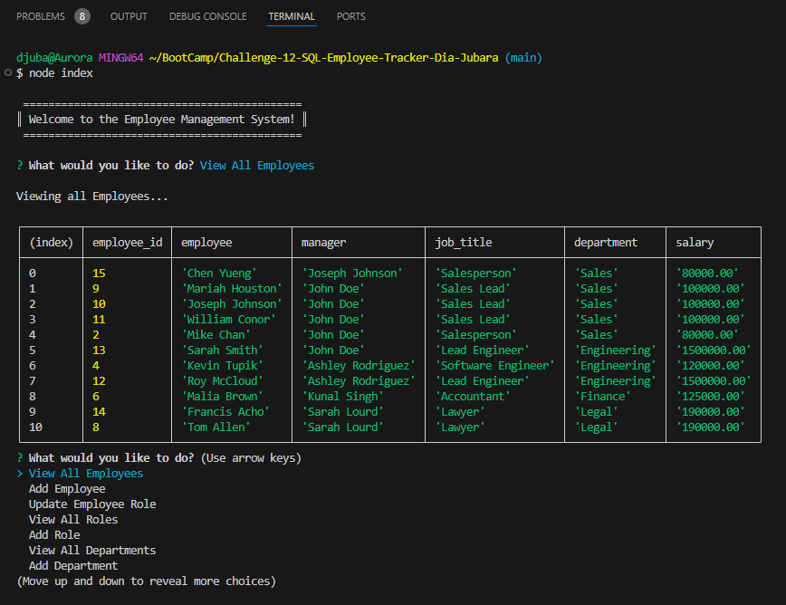

  > # Employee Tracker

  >

  > ## Table of Contents

  1. [Description:](#description)
  2. [Installation:](#installation)
  3. [Usage:](#usage)
  4. [How to Contribute:](#how-to-contribute)
  
  6. [Test Instructions:](#test-instructions)
  7. [Questions:](#questions)

## User Story

```md
AS A business owner
I WANT to be able to view and manage the departments, roles, and employees in my company
SO THAT I can organize and plan my business
```

## Acceptance Criteria

```md
GIVEN a command-line application that accepts user input
WHEN I start the application
THEN I am presented with the following options: view all departments, view all roles, view all employees, add a department, add a role, add an employee, and update an employee role
WHEN I choose to view all departments
THEN I am presented with a formatted table showing department names and department ids
WHEN I choose to view all roles
THEN I am presented with the job title, role id, the department that role belongs to, and the salary for that role
WHEN I choose to view all employees
THEN I am presented with a formatted table showing employee data, including employee ids, first names, last names, job titles, departments, salaries, and managers that the employees report to
WHEN I choose to add a department
THEN I am prompted to enter the name of the department and that department is added to the database
WHEN I choose to add a role
THEN I am prompted to enter the name, salary, and department for the role and that role is added to the database
WHEN I choose to add an employee
THEN I am prompted to enter the employee’s first name, last name, role, and manager, and that employee is added to the database
WHEN I choose to update an employee role
THEN I am prompted to select an employee to update and their new role and this information is updated in the database 
```

  > ## Description

  To build a command-line application that tracks and manages a company's employee database using Node.js, Inquirer, and PostgreSQL.

* **Screenshot:**

  
  
   **Video:**

  [![Watch the video]](https://app.screencastify.com/v3/watch/yGbpZ5ZHnWMTZKRjxaST)

  > ## Installation

  1. Clone the repository.
  2. Install dependencies by typing `npm i` in the CLI.
  3. Run `node index.js`

  > ## Usage

  Manage an employee database.
  
  > ## How to Contribute

  Create a pull request or raise an issue.
  
  >

  > ## Test Instructions

  N/A
  
  > ## Questions

  If you have any question please [djubara](https://github.com/djubara) or send me an email to: <djubara@hotmail.com>
